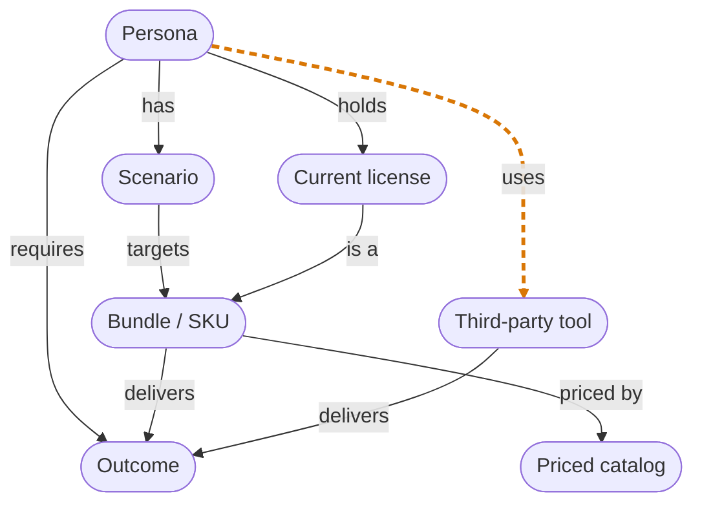

# Data map — how the first-class objects connect

The model rests on four first-class objects — **Persona**, **Outcome**,
**Bundle/SKU**, **Scenario** — plus two spend-source objects and a priced
catalog. This map shows every edge in the real schema (`backend/app/models.py`)
and the single rule the engine (`backend/tco_engine/engine.py`) uses to read
them. It is the schema, not an idealization; keep it in sync when the model
changes.

## The objects

| Object | Role | Identity |
| --- | --- | --- |
| **Persona** | A group of users with a `headcount`. The anchor — nearly every edge starts here. | engagement-scoped uuid |
| **Outcome** | A capability ("Identity & SSO", "Team Chat"). The shared vocabulary both Microsoft and third-party tools are measured against. | uuid + `seed_key` |
| **Bundle / SKU** | A Microsoft licensing bundle (E3, E5, Business Premium). *Delivers* outcomes; *priced by* catalog variants. | `Bundle` |
| **Scenario** | One per persona: the target bundle (+ add-ons) they'd move to. The unit the engine sums into the number. | `PersonaScenario` |
| **Priced catalog** | A bundle's price at a segment / term / billing plan. Where a bundle becomes a dollar figure. | `MicrosoftSku` |
| **Current license** *(spend today)* | What a persona holds now. Resolves to a Bundle (its outcomes) and a paid price. | `CurrentMicrosoftLicense` |
| **Third-party tool** *(spend today)* | Non-Microsoft spend (Okta, Slack). *Delivers* outcomes; *used by* specific personas. | `ThirdPartyProduct` |

## The map

Solid edges are relationships the model stores **and** the engine reads. Edge 7
(`Persona → uses → Third-party tool`, dashed) is stored too, but until the
persona-scoped displacement fix (ENGINE_SPEC §6.3a) the engine never walked it —
which let a tool's retirement credit leak to any persona whose target covered the
outcomes, regardless of whether that persona held the tool.

## The joins (every many-to-many is a first-class association object)

| Edge | Association object | Means |
| --- | --- | --- |
| Persona → Outcome | `PersonaRequirement` | capabilities this persona needs |
| Persona → Current license | `CurrentLicensePersona` | who holds which Microsoft license today |
| Persona → Third-party tool | `ThirdPartyPersona` | who **uses** which tool (scopes displacement, §6.3a) |
| Bundle / Tool → Outcome | `CoverageMapEntry` | what each delivers (only when `ratified`) |
| Scenario → Bundle | `ScenarioAddon` | add-ons layered on the base target (`target_sku_reference`) |
| Bundle → Priced catalog | `MicrosoftSku` | price per segment / term / billing |

No delimited strings, no shadow representations — each edge is a real row with
identity, per the data-architecture law.

## The engine's one question

Everything above exists to answer one question, per persona, per tool:

> A persona's move retires a third-party tool when the tool is **used by that
> persona** (§6.3a) **and** the persona's **target bundle delivers every outcome
> the tool delivers** (§6.6).

The engine walks:

- ✓ `Scenario → targets → Bundle → delivers → Outcome` — does the target cover it?
- ✓ `Third-party tool → delivers → Outcome` — what does the tool provide?
- ✓ `Persona → uses → Third-party tool` — does this persona hold it? *(added in §6.3a; previously skipped)*

All three gates now hold before a tool's cost is credited against a persona's move.
