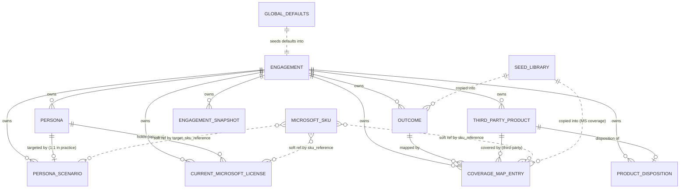

# Data Model & First-Class Data Sets

This is the canonical reference for every first-class data set in the M365 TCO
Tool, the relationships between them, and the **repeatable module contract** that
each one obeys. The goal is the one stated by the practice: build robust data
structures and repeatable CRUD modules so we never hand-roll a one-off
("snowflake") path every time we touch a particular piece of data.

Read this alongside:
- [`DATA_ARCHITECTURE.md`](DATA_ARCHITECTURE.md) — the law this model obeys:
  everything is a first-class object; minimize data that lives outside one.
- [`ENGINE_SPEC.md`](ENGINE_SPEC.md) — the language-neutral calculation algorithm.
- `backend/app/models.py` — the SQLAlchemy rendering of everything below.

---

## 1. Principles (why this document exists)

1. **One shape per data set.** Every first-class data set has exactly one schema,
   one identity strategy, one CRUD surface, one write-normalization path, and one
   provenance field. If you need the data somewhere new, you reuse that module —
   you do not invent a parallel representation.
2. **The Engagement is the aggregate root.** Almost all customer data is scoped to
   an Engagement and lives and dies with it. Global reference data (the SKU
   catalog, seed libraries) is the only thing that lives outside an engagement.
3. **Derive on write, never on read.** Money is normalized to annualized USD and
   all derived fields (per-unit cost, effective cost, annual prices) are computed
   once, at write time, in a single function. Reads and the engine never
   re-derive.
4. **Separate who owns each field.** Every field is owned by exactly one of:
   _user-entered_, _seeded_, _derived-on-write_, or _engine-output_. Modules that
   recompute must preserve fields they do not own.
5. **Provenance is universal.** Every value-bearing, user-entered record carries a
   `source_tag` so hard inputs are separable from soft ones on the readout.
6. **The ratify gate is the only door to the math.** Unratified coverage (AI
   suggestions) is real data but is invisible to the engine until a human
   ratifies it.

---

## 2. The Entity Module Contract

Every first-class data set is defined by answering the same eight questions. When
you add a new data set (e.g. a future migration-ROM overlay), fill in this
contract — that is what keeps it from becoming a snowflake.

| # | Contract field | What it pins down |
| --- | --- | --- |
| 1 | **Identity** | Primary key strategy. Default: server-generated `uuid` string. Catalog rows add a **natural key** for upsert. |
| 2 | **Scope / owner** | Which aggregate owns the row. Default: `engagement_id` FK, cascade-deleted with the engagement. Global data sets say "global". |
| 3 | **Relationships** | FKs out, and whether each link is a **hard FK** or a **soft reference** (string). |
| 4 | **Field ownership** | Each field tagged user-entered / seeded / derived-on-write / engine-output. |
| 5 | **Write-normalization** | The single function that runs on every create/update to compute derived fields and normalize periods. |
| 6 | **CRUD surface** | The uniform REST verbs, plus any domain actions (e.g. `ratify`, `override`). |
| 7 | **Provenance** | `source_tag` (value-bearing user data) and/or `ai_suggested` + `ratified` (proposed data). |
| 8 | **Lifecycle** | Created when? Copied from a library? Recomputed by the engine? Snapshotted? |

---

## 3. Entity-Relationship overview



Solid lines are hard foreign keys with cascade delete. **Dotted lines are soft
references** — a string (`sku_reference`) resolved by lookup, not a database FK
(see §5).

---

## 4. First-class data sets

Each section states the contract. "Engagement-scoped" everywhere means: `engagement_id`
FK, UUID PK, cascade-deleted with the engagement.

### 4.1 Engagement — the aggregate root
- **Identity:** `uuid`. **Scope:** root (owns everything else).
- **Relationships:** one-to-many to all eight child sets, all `cascade="all, delete-orphan"`.
- **Field ownership:** user-entered (`customer_name`, `market`, `currency`,
  `notes`, `global_tooling_pct`, `modeling_horizon_years`, `default_segment`,
  `default_term_duration`, `default_billing_plan`); derived
  (`created_at`, `updated_at`).
- **CRUD:** `GET/POST/PATCH/DELETE /api/engagements`, plus `duplicate`, `compute`,
  `readout.html`, `readout.xlsx`, `snapshots`.
- **Lifecycle:** on create, seeds outcomes + Microsoft coverage from the seed
  library (§6), and copies `default_segment` from `GlobalDefaults`. `duplicate`
  deep-copies every child (and the basis defaults) with id remapping.
- **Note:** `global_tooling_pct` is the engagement default for the managed split;
  individual third-party rows may override it.
- **Pricing-basis inheritance:** `default_segment` / `default_term_duration`
  (P1Y) / `default_billing_plan` (Annual) are the middle tier of a three-level
  chain — **GlobalDefaults → Engagement → line item** — that selects which priced
  catalog variant a picked SKU resolves to. A Nonprofit customer sets
  `default_segment = Nonprofit` once; a `CurrentMicrosoftLicense` can still
  override any of the three per line (§4.5). Because the tuple `(segment, term,
  billing)` resolves to exactly one priced `MicrosoftSku` row, the list price
  seeded on a SKU pick is the correct variant's — no silent same-title collapse.
  All three are GUI-surfaced: the global default in Settings → Defaults, the
  engagement default and per-line overrides on the Current Licensing tab.

### 4.2 Persona
- **Identity:** `uuid`. **Scope:** engagement-scoped.
- **Field ownership:** user-entered (`name`, `headcount`, `description`); provenance (`source_tag`).
- **CRUD:** `GET/POST/PATCH/DELETE /api/engagements/{eid}/personas`.
- **Relationships:** referenced by `PersonaScenario.persona_id` and optionally
  `CurrentMicrosoftLicense.persona_id`. **Required capabilities** via
  `PersonaRequirement` (§4.2a).
- **GUI surface:** the Personas tab is an expandable line-item — core fields up top,
  an expander of required-capability toggles.

### 4.2a PersonaRequirement — a persona's required capabilities
- **Identity:** `uuid` plus a unique `(persona_id, outcome_id)`. **Scope:**
  engagement-scoped (via the persona). **Association object** — the many-to-many
  Persona ↔ Outcome "this persona requires this capability."
- **Field ownership:** user-entered (toggled on the Personas tab). Reconciled diff-wise
  on persona create/PATCH (`required_outcome_ids` on `PersonaIn`/`PersonaOut`); soft
  refs to engagement outcomes are validated (unknown ids dropped).
- **Why it exists:** a persona's *needs* are independent of what its current licenses
  happen to deliver. These outcomes are added to the **required** set in
  recommend-a-path (`analyze_persona_bundles`), so a bundle that misses one shows a
  **gap** — e.g. a persona requiring *Desktop Software* / *Full-Size Cloud Storage*
  won't be recommended a Frontline (F1/F3) bundle without flagging the shortfall. It
  feeds recommend-a-path only; the core reconciliation engine is unchanged.

### 4.3 Outcome — capability buckets
- **Identity:** `uuid`. **Scope:** engagement-scoped (5.3.1 — scoped copies so
  edits never mutate the global library).
- **Field ownership:** seeded (`name`, `description`, `seed_key` from the library);
  user-entered when added mid-workshop (`is_custom = true`).
- **CRUD:** `GET/POST/PATCH/DELETE …/outcomes`.
- **Lifecycle:** copied from `seeds/outcomes.json` on engagement creation; freely
  extended at runtime.

### 4.4 MicrosoftSku — the global catalog
- **Identity:** `uuid` PK **plus a natural key** for upsert:
  `product_id + sku_id + term_duration + billing_plan + market`.
- **Scope:** **global** (not engagement-scoped). Shared reference data.
- **Field ownership:** ingested (`product_title`, `unit_price_monthly`,
  `erp_price_monthly`, …); derived-on-import (`annual_unit_price`,
  `annual_erp_price`, normalized per §8.3 of the PRD).
- **Bundle mapping (SKU → Bundle spine):** `bundle_id` is the **ratified/accepted**
  staple bundle a priced variant collapses onto (many-to-one, null until mapped).
  `suggested_bundle_id` + `bundle_suggestion_reason` hold the import-time AI
  mapper's **unratified** proposal — mirroring `CoverageMapEntry`'s
  suggested/ratified split so a mapping never silently enters the spine. Accepting
  moves the suggestion into `bundle_id` and clears it; rejecting clears it and
  leaves the SKU unmapped. All three are surfaced/editable in Settings → Staple
  bundles (`GET /api/catalog/skus`, `?unmapped=true` for the work-list).
- **Write-normalization:** `services/pricesheet.py` — header-mapped parse,
  **all segments ingested** (no Commercial-only filter — segment curation is an
  engagement-scoped, inherited concern, not an ingest-time drop), annualization,
  upsert by natural key keeping the latest active row by `effective_end_date`.
  `segment` is stored per row; `GET /api/catalog/skus` accepts `segment` / `term`
  / `billing` filters and returns the FULL catalog by default (`limit` is opt-in,
  never a silent cap); `GET /api/catalog/segments` lists the distinct segments
  present for the data-driven pickers. The AI mapper lives in `services/ai.py`
  (`suggest_bundle_mappings` + pure `normalize_bundle_suggestions`) with its
  editable instructions in the `sku_bundle_map` AiPrompt.
- **CRUD:** read-only pricing over the API (`GET /api/catalog/skus`); prices written
  only by the CSV import and the price-sheet sync module. The bundle mapping is
  written by `POST /api/catalog/skus/suggest-bundles` (AI, unratified),
  `PATCH /api/catalog/skus/{id}/bundle` (accept/set), and
  `POST /api/catalog/skus/{id}/reject-suggestion` (dismiss).
- **Why global:** the catalog is large, versioned, and identical across customers;
  duplicating it per engagement would be the opposite of repeatable.

### 4.4a CatalogImport — pricing-load provenance
- **Identity:** `uuid`. **Scope:** **global** (one row per successful catalog load).
- **Field ownership:** recorded on success by whichever path loaded pricing —
  `source` (`CsvUpload` | `PriceSyncApi` | `Reconciled`), `data_month` (from the
  sheet's own `LastUpdatedDate` for CSV, or the API metadata for price-sync;
  current month only if the sheet reports no date), `catalog_version`, `sku_count`,
  `imported_at`, and (price-sync only) `file_name`/`sha256`.
- **Write-normalization / CRUD:** `services/catalog_provenance.py` — the single
  `record_import()` writer, plus `latest()`, `pricing_freshness()`,
  `derive_catalog_signal()`, and `reconcile_missing_provenance()`.
- **Why it exists:** freshness (the Readout pricing badge and the staleness
  banner) must reflect *whichever source ran most recently and worked*. A row
  only exists for a load that succeeded, so "newest row across sources" is
  exactly "newest successful pricing." Without it, a CSV-only operator's upload
  was invisible to freshness and pricing read `not set · stale`.
- **Freshness can never contradict the loaded catalog.** The provenance record is
  a *separate object* from the catalog (`MicrosoftSku`) it describes, so the two
  could historically drift: a catalog imported before provenance recording
  existed left `MicrosoftSku` full but `catalog_imports` empty, and the badge read
  `not set · stale` next to "1448 SKUs". Two mechanisms close this:
  (1) `derive_catalog_signal()` computes a freshness *floor* from the catalog
  itself — its `catalog_version` month, else the newest SKU effective-start date —
  so `pricing_freshness()` classifies the loaded catalog even with no record;
  (2) `reconcile_missing_provenance()` runs once at startup to materialize a
  `Reconciled` row from that same signal, so the provenance history and the loaded
  catalog agree. `Reconciled` is labelled as inferred (not an observed load) on the
  readout. A real `CsvUpload`/`PriceSyncApi` load always outranks the derived floor
  because it carries a true, newer `imported_at`.

### 4.4b Bundle — the staple bundle spine (SKU → Bundle → Outcomes)
- **Identity:** `uuid` plus a unique `key`. **Scope:** **global**, editable,
  seeded from `seeds/bundles.json` (`services/bundles.py`).
- **Shape:** `name`, `kind` (`bundle` = a full base like *Microsoft 365 E3*;
  `addon` = a composable add-on like *E5 Security* whose `base_bundle_id` names the
  base it layers onto), `sort_order`.
- **CRUD (slice E2-bundles):** `GET/POST/PATCH/DELETE …/catalog/bundles`, edited in
  Settings → Staple bundles (inline name/kind/base/sort + add-bundle form). Shape
  rules are enforced (a base has no parent; an add-on must point at an existing base
  bundle). **Delete is blocked (409) while anything references the bundle** —
  `MicrosoftSku.bundle_id`/`suggested_bundle_id`, `CoverageMapEntry.bundle_id`,
  `ScenarioAddon.bundle_id`, or a child add-on — so a delete never orphans the spine.
  `key` is immutable (the stable id); a deleted *seed* staple is re-created on the
  next startup by `seed_bundles`, so delete is meaningful for operator-added bundles.
- **Why it exists:** the stable identity between the many priced catalog SKUs and
  the outcomes. `MicrosoftSku.bundle_id` collapses catalog variants onto one
  bundle (many-to-one, AI-filled on import + editable); coverage/scenarios/licenses
  resolve *through* the bundle rather than an ambiguous SKU shortcode. Kills the
  "E3 = which E3?" problem and gives the displacement test a stable key.
- **Status:** coverage re-keys onto `bundle_id` (slice B); a scenario's future
  state composes a base bundle **+** add-ons (slice C), and recommend-a-path
  composes the cheapest gap-closing add-ons (slice D); the import-time AI mapper
  proposes `MicrosoftSku.suggested_bundle_id` for operator review (slice E1); the
  bundle library and per-engagement coverage map are GUI-editable (slice E2); the
  default coverage library (§4.4c) is a first-class editable table (slice E3).

### 4.4c DefaultBundleCoverage — the global default coverage library
- **Identity:** `uuid` plus a unique `(bundle_key, outcome_key)`. **Scope:** **global**,
  editable, seeded from `seeds/coverage.json` on first run (`services/seeds.py`,
  populate-if-empty — the same pattern as `DefaultOutcome`).
- **Shape:** `bundle_key` (a `Bundle.key`), `outcome_key` (a `DefaultOutcome.key`),
  `coverage` (always `Full` — coverage is binary, the row's existence is the signal).
  Stable keys, not ids, so it survives reseeding and
  reads like the seed file.
- **Why it exists:** the Microsoft bundle → outcome coverage new engagements inherit
  was a static file, invisible/uneditable in the GUI. It's now a first-class table:
  `seed_engagement` copies **from it** (resolving `bundle_key`→Bundle, `outcome_key`→the
  engagement's seeded Outcome) into engagement-scoped `CoverageMapEntry` rows
  (`ratified = true`). Editing the default (Settings → Bundle coverage) changes the
  template for **new** engagements only; existing engagements keep their own copy.
- **CRUD:** `GET/POST/PATCH/DELETE …/admin/default-coverage` (keys validated against the
  bundle library + `DefaultOutcome`; the pair is unique; PATCH edits coverage only).
  `seeds/coverage.json` remains the version-controlled seed source.

### 4.5 CurrentMicrosoftLicense — the customer's existing licensing
- **Identity:** `uuid`. **Scope:** engagement-scoped.
- **Relationships:** **soft ref** to a `MicrosoftSku` via `sku_reference` (free
  text, validated against the catalog in the UI); **many-to-many** to `Persona`
  via `CurrentLicensePersona` (§4.5a). The legacy single `persona_id` column is
  deprecated (kept only for the one-time backfill).
- **Field ownership:** user-entered (`quantity_assigned` ← model on this not
  purchased, `unit_price_paid_annual`, `price_basis`, `discount_pct`, and the
  per-line basis overrides `segment` / `term_duration` / `billing_plan` where
  NULL = inherit the engagement default per §4.1); provenance.
  API exposes `persona_ids` (the tags), not `persona_id`.
- **CRUD:** `GET/POST/PATCH/DELETE …/current-licenses`; `persona_ids` on the body
  replaces the tag set.
- **Engine role:** the Microsoft side of a persona's current spend. A line's
  total cost is distributed across its tagged personas by headcount (ENGINE_SPEC
  6.2), so a shared line is never double-counted.

### 4.5a CurrentLicensePersona — license↔persona tags
- **Identity:** `uuid` plus a unique `(current_license_id, persona_id)`.
  **Scope:** engagement-scoped (via the license). **Association object** — the
  first-class many-to-many so one line can apply to several personas.
- **Why first-class:** it's the seam where the future **partial application**
  (e.g. "5% of Knowledge Workers") will live as an `applies_pct` field on the
  tag, without reshaping the license or the engine contract.

### 4.6 ThirdPartyProduct — non-Microsoft spend
- **Identity:** `uuid`. **Scope:** engagement-scoped.
- **Field ownership:** user-entered (`name`, `raw_cost`, `cost_period`,
  `covered_count`, `is_managed`, `tooling_pct`, `renewal_date`); **derived-on-write**
  (`annual_cost`, `effective_annual_cost`, `per_unit_annual_cost`); provenance.
- **Write-normalization:** `_normalize_third_party()` in `routers/entities.py` —
  the single place that: annualizes (`×12` if monthly), applies the managed split
  (`effective = annual × tooling_pct` when managed, else `annual`), and computes
  `per_unit = effective / covered_count`. Every create/update calls it; nothing
  else computes these.
- **CRUD:** `GET/POST/PATCH/DELETE …/third-party`; `persona_ids` on the body
  reconciles the tag set.
- **Relationships:** target of `CoverageMapEntry` (third-party) and of exactly one
  `ProductDisposition`; **many-to-many** to `Persona` via `ThirdPartyPersona`
  (§4.6a), mirroring current licensing.

### 4.6a ThirdPartyPersona — product↔persona tags
- **Identity:** `uuid` plus a unique `(third_party_product_id, persona_id)`.
  **Scope:** engagement-scoped (via the product). **Association object** — the
  many-to-many mirror of `CurrentLicensePersona`, so one product can serve several
  personas and is the future home of partial application (`applies_pct`). Today the
  tags are attribution/presentation; how they feed the engine (offset scoping vs
  covered-population) is a deliberate open decision, so the math is unchanged.

### 4.7 CoverageMapEntry — the product↔outcome matrix
> **Bundle-keyed (slice B):** Microsoft SKU coverage now carries `bundle_id` (the
> canonical §4.4b Bundle it applies to); `microsoft_sku_reference` holds the bundle
> name for display. The engine keys coverage by `bundle_id or microsoft_sku_reference`
> and resolves scenario/license references through `services/bundles.resolve_bundle`
> — so `Microsoft 365 E3`, `E3`, or a mapped catalog title all land on the same
> coverage. Existing rows are backfilled onto bundles on startup.
- **Identity:** `uuid`. **Scope:** engagement-scoped.
- **Relationships:** hard FK `outcome_id`; **polymorphic product link** keyed by
  `product_kind`: `MicrosoftSku` → soft ref `microsoft_sku_reference` (string);
  `ThirdParty` → hard FK `third_party_product_id`.
- **Field ownership:** seeded (Microsoft coverage, `ratified = true`); user-entered
  or AI-proposed (third-party).
- **Provenance / gate:** `ai_suggested` + `ratified`. **Only `ratified = true`
  rows hydrate into the engine.** This is the single ratify gate.
- **CRUD:** `GET/POST/PATCH/DELETE …/coverage`, plus the domain action
  `POST …/coverage/{id}/ratify`.
- **GUI surface (slice E2):** the Coverage map now edits **Microsoft bundle
  coverage** too, not just third-party — a per-bundle editor (add/remove an outcome,
  ratify) mirroring the third-party section. Adding by bundle name resolves onto the
  bundle (`bundle_id` set) via `resolve_bundle`; entries that resolve to no staple
  are surfaced under "Unmapped Microsoft references" so nothing is hidden.

### 4.8 PersonaScenario — the target-state plan
- **Identity:** `uuid`. **Scope:** engagement-scoped. One per persona in practice.
- **Relationships:** hard FK `persona_id`; **soft ref** to the base target bundle
  via `target_sku_reference`; **add-on bundles** via `ScenarioAddon` (§4.8a).
- **Field ownership:** user-entered (`target_sku_reference` + `target_unit_price_annual`
  = the base bundle & its list price, `target_discount_pct`, `in_scope`);
  **engine-output cache** (`current_spend_annual`, `target_spend_annual`, `delta_annual`).
- **Composition:** future state = base bundle **+** add-ons. The hydrator unions the
  covered outcomes and sums the list prices, then applies the discount → the net
  `target_unit_price_annual` the engine consumes (ENGINE_SPEC 6.2/6.3).
- **CRUD:** `GET/POST/PATCH/DELETE …/scenarios` (`addons` on the body reconciles the
  set). Toggling `in_scope` and calling `compute` triggers a **total** recompute.

### 4.8a ScenarioAddon — an add-on bundle on a scenario
- **Identity:** `uuid`. **Scope:** engagement-scoped (via the scenario).
  **Association object** linking a scenario to an add-on `Bundle` with its own
  `unit_price_annual`. Composing base + add-ons is how "E3 + E5 Security" is modeled.

### 4.9 ProductDisposition — split ownership, by design
This is the canonical example of the field-ownership rule, because one row mixes
operator-owned and engine-owned fields.
- **Identity:** `uuid`. **Scope:** engagement-scoped. One per third-party product.
- **Operator-owned (survive recompute):** `override`, `override_reason`,
  `residual_intent`.
- **Engine-output (overwritten every compute):** `displaced_users`,
  `disposition`, `residual_count`, `residual_annual_cost`.
- **Module rule:** `services/compute.py` reads the operator-owned fields **into**
  the engine and writes only the engine-output fields **back** — it never clobbers
  an operator's choice. The override endpoint writes only operator fields.
- **CRUD:** upserted by `compute`; operator fields set via
  `PUT …/dispositions/{tp_id}/override` (which enforces "reason required for
  ForceFullElimination").

### 4.10 EngagementSnapshot — reproducible readout
- **Identity:** `uuid`. **Scope:** engagement-scoped (now cascades with the
  engagement like every other child).
- **Field ownership:** engine-output frozen at capture time (`payload_json`),
  plus `label`, `catalog_version`, `created_at`.
- **CRUD:** `POST/GET …/snapshots`, `GET …/snapshots/{id}`. Immutable once written
  — a snapshot is a record, not editable state.

### 4.10a Best-bundle analysis (derived, persists nothing)
The optimizer (`tco_engine/optimizer.py`) evaluates every candidate Microsoft
bundle as a persona's target and ranks by TCO. It is a **pure computation over
existing first-class objects** — it stores no new state, which is the correct
"don't create second-class data" outcome:
- **Candidate bundles**: the `is_bundle` Microsoft SKUs from the coverage seed,
  intersected with the engagement's ratified `CoverageMapEntry` rows.
- **Required outcomes** (v1): derived from the outcomes the persona's current
  Microsoft licenses deliver (gap detection baseline). *If explicit per-persona
  requirements are later wanted, add a `PersonaOutcomeRequirement` first-class
  join following §2 — do not stash them in a blob.*
- **Added outcomes**: bundle coverage minus everything the persona has today
  (MS + third-party) — the upside story.
- **Prices**: catalog annual ERP by best-effort match, overridable per request.
The chosen bundle is applied by writing a normal `PersonaScenario` (§4.8); the
analysis itself is transient.

### 4.10a-bis Pre-readout sanity check (derived, persists nothing)
`POST …/sanity-check` runs an advisory AI pass right before a readout: it
computes the engagement, builds a compact summary (`services/sanity.build_sanity_payload`
— pure), and asks an **inexpensive** model (`GlobalDefaults.sanity_check_model`,
else `settings.sanity_check_model`) via the editable `readout_sanity_check`
AiPrompt to flag likely mistakes (implausible per-seat prices, assigned > purchased,
coverage/headcount mismatches, contradictory deltas). It returns
`[{severity, field, message}]` for the operator to eyeball on the Readout view.
Like §4.10a it **stores no new state and never feeds the math** — it is a pure
read over existing first-class objects, the correct "don't create second-class
data" outcome. `services/sanity.normalize_findings` is the pure validator (kept
separate from the HTTP call for unit testing).

### 4.10b AiPrompt — editable AI instructions
- **Identity:** `uuid` PK plus a unique `key` per AI function
  (`coverage_suggest`, `third_party_parse`, `current_license_parse`,
  `sku_bundle_map`, `readout_sanity_check`). **Scope:** **global**.
- **Field ownership:** seeded from `seeds/ai_prompts.json` (`label`,
  `description`, `instructions`); the operator edits `instructions` at runtime and
  can reset to the seeded default. `updated_at` stamps edits.
- **Why first-class:** every AI call's system prompt is a row here, not a string
  literal in `services/ai.py` — so what is consistently being sent is visible and
  tunable in one place (Settings) when output isn't great. `services/ai_prompts.py`
  is the uniform CRUD/seed module; new AI functions add a seed key and are
  inserted on startup without disturbing operator edits to existing ones.
- **Advisory only:** editing a prompt never changes stored engagement data; AI
  output still passes through review (coverage ratification / parse preview).

### 4.11 Out-of-band data sets
- **GlobalDefaults / Settings (PRD 5.10):** the single-row `GlobalDefaults` table
  holds operator-editable, engagement-seeded defaults — `default_tooling_pct`,
  `default_modeling_horizon_years`, `default_segment` (the ground floor of the
  pricing-basis chain, §4.1), and the operational `openrouter_model` /
  `sanity_check_model` (the latter an inexpensive model for the advisory
  pre-readout sanity check; blank falls back to `settings.sanity_check_model`).
  Edited in Settings → Defaults (`GET/PUT /api/admin/defaults`); new engagements
  copy the domain defaults on creation ("seed, then own"). The versioned **seed files**
  (`outcomes.json`, `coverage.json`) remain the source for the outcome/coverage
  libraries. Add new global defaults here, not as scattered constants.
- **Secrets:** the OpenRouter key lives in the encrypted store
  (`services/secrets.py`), not the relational DB. Same get/set/delete contract,
  swappable for Azure Key Vault. Price-sheet sync uses interactive login and
  stores no token.

---

## 5. Hard FKs vs soft references (an explicit rule)

Two link styles exist on purpose:

- **Hard FK** (`persona_id`, `third_party_product_id`, `outcome_id`): both rows
  live in the same engagement; integrity and cascade matter; resolution is a join.
- **Soft reference** (`sku_reference`, `target_sku_reference`,
  `microsoft_sku_reference`): a **string** naming a Microsoft SKU. We use a soft
  ref because:
  1. the catalog is **global and versioned** while the reference is
     **engagement-local**, so a hard FK would couple a customer row to a specific
     catalog row that may be superseded next month;
  2. a customer may name a SKU the current catalog does not (yet) contain;
  3. the engine's displacement test keys off the **coverage map**, which is itself
     keyed by the same `sku_reference` string — so the string is the join key
     across coverage, scenarios, and current licenses consistently.

Rule of thumb: **same-engagement → hard FK; reference to global/versioned catalog
→ soft string ref.** Resolve soft refs through one lookup helper, never ad hoc.

---

## 6. Lifecycle flows

### 6.1 Engagement creation (library → scoped copy)
`POST /api/engagements` → `services/seeds.seed_engagement()`:
1. copy every `outcomes.json` entry into an engagement-scoped **Outcome** (carry
   `seed_key`);
2. copy every `coverage.json` Microsoft-SKU mapping into an engagement-scoped
   **CoverageMapEntry** (`ratified = true`).
The global library is never mutated by workshop edits — this is the
"scoped copy, not shared mutable state" pattern.

### 6.2 Compute (hydrate → engine → persist)
`compute.compute_and_persist()`:
1. **Hydrate** ORM rows into pure engine dataclasses, applying the **ratify gate**
   (only `ratified` coverage becomes outcome sets) and reading operator-owned
   disposition fields.
2. Run the pure engine (`tco_engine.compute`).
3. **Persist back** only engine-output fields (scenario spend cache + disposition
   outputs), preserving operator-owned fields.

### 6.3 Snapshot
`POST …/snapshots` computes, then freezes the serialized result + `catalog_version`
so the readout reproduces even after the global catalog updates.

---

## 7. CRUD surface conventions (the repeatable module)

Every engagement-scoped data set exposes the **same** REST shape, implemented the
same way in `routers/entities.py`:

```
GET    /api/engagements/{eid}/{collection}            list
POST   /api/engagements/{eid}/{collection}            create  (+ write-normalization)
PATCH  /api/engagements/{eid}/{collection}/{id}       partial update (+ write-normalization)
DELETE /api/engagements/{eid}/{collection}/{id}       delete
```

Conventions that make it repeatable, not snowflaked:
- Every handler first calls `_require_engagement(db, eid)` — one ownership guard.
- Every sub-resource handler re-checks `row.engagement_id == eid` before mutating,
  so an id from another engagement 404s instead of leaking.
- Create/update for any data set with derived fields routes through that set's
  single write-normalization function (e.g. `_normalize_third_party`).
- **Domain actions are explicit verbs**, not magic fields: `…/ratify`,
  `…/dispositions/{id}/override`, `…/duplicate`, `…/compute`.

**Adding a new first-class data set:** define the §2 contract, add the ORM model
(UUID PK, `engagement_id` FK, cascade relationship on Engagement), add Pydantic
in/out schemas, and add the four CRUD routes + any write-normalization. Do not
introduce a second way to represent or fetch that data.

---

## 8. Field-ownership cheat sheet

| Ownership | Who writes it | Examples | Recompute behavior |
| --- | --- | --- | --- |
| **User-entered** | The SA in the workshop | headcount, raw_cost, target price, `in_scope`, override choice | Never overwritten by compute |
| **Seeded** | Library copy on create | Outcome name, Microsoft coverage | Editable; `is_custom`/`seed_key` track origin |
| **Derived-on-write** | Normalization fn at write | annual_cost, per_unit, effective cost, annual prices | Recomputed on every create/update |
| **Engine-output** | `compute` only | disposition, residual, scenario spend cache | Overwritten on every compute |

If a field's owner is ambiguous, that is a design smell — pick one before shipping.

---

## 9. Provenance & confidence

- `source_tag ∈ {Invoice, CustomerStated, ListPrice, Estimate,
  AISuggestedUnconfirmed}` on every value-bearing user record. The readout can
  filter/annotate by it so hard inputs are separable from soft ones.
- `ai_suggested` + `ratified` on coverage entries gate AI proposals out of the
  math until a human confirms.
- Together these mean **every number on the readout is traceable** to who asserted
  it and how confident we are — which is what survives a CFO review.

---

## 10. Future overlays (extend without rebuild)

The deferred modules attach as **new first-class data sets following this same
contract**, never as edits to the engine's core tables:
- **Migration cost ROM** — a one-time-cost overlay table, engagement-scoped,
  joined into the readout as a separate line.
- **ECIF / funding offset** — an offset-line table, same pattern.
- **Soft savings (Forrester TEI)** — its own scoped data set, segregated from hard
  savings on the readout.

Each is added by filling in the §2 contract and the §7 CRUD surface — proving the
point of this document: new data is a new module, not a new snowflake.
