# Target schema — the agreed data model (design, not yet built)

> **Status: agreed design, implementation pending.** This document is the contract
> for the data-model rebuild. It was agreed in a design review of how personas,
> licences, outcomes, scenarios and the catalog connect, after an audit found the
> same questions answered different ways on different screens.
>
> - The **current** code is still described by [`DATA_MODEL.md`](DATA_MODEL.md),
>   [`DATA_MAP.md`](DATA_MAP.md) and [`DATA_ARCHITECTURE.md`](DATA_ARCHITECTURE.md).
>   Those stay accurate for today's code until each part below lands.
> - **Every schema PR must match this document.** A change that needs to deviate
>   updates this document first, in its own reviewed PR.
> - When the rebuild is complete, this document replaces `DATA_MODEL.md` and
>   `DATA_MAP.md`, and the rule changes in §13 are applied to
>   `DATA_ARCHITECTURE.md` and `CLAUDE.md`.
> - Decisions D19–D24 and the columns and tables marked *(walkthrough)* come from
>   the guided-walkthrough design, [`WALKTHROUGH.md`](WALKTHROUGH.md) §12. Those
>   pieces may be built on today's schema ahead of the rebuild, in exactly the
>   shape given here.

---

## 0. The decisions this schema encodes

| # | Decision | Where it lives |
| --- | --- | --- |
| D1 | **One model of current → proposed state.** A persona × outcome table is the single source for every screen, export and number. | §6.3 |
| D2 | **Three layers.** Raw (only people write it), Interpreted (rebuilt from raw), Calculated (engine output). | §1, §4–§7 |
| D3 | **Raw data is never rewritten by code.** No normalizer, backfill, recompute or view overwrites what a person entered. | §1.2 |
| D4 | **Full history of raw data**, with who changed what and when. | §9.4 |
| D5 | **Multi-user always.** Every write has an actor; stale saves are refused, never silently overwritten. | §9 |
| D6 | **Postgres only**, with a real migration tool (Alembic). | §10 |
| D7 | **Live catalog, anchored on permanent keys.** Names, prices and SKU mappings follow the catalog; renames can't break anything. | §3 |
| D8 | **The library seeds each engagement; updates are reviewed.** An engagement takes its own copy of the library's outcomes and Microsoft coverage when it is created. A later library change reaches it only when someone applies it on the Library updates review, and "not for this customer" is remembered. Third-party coverage stays per engagement. *(Revised by the walkthrough's licence-mapping design; it was "live library with engagement exceptions".)* | §3.3, §4.7 |
| D9 | **List prices are live; a typed price is a fixed override.** | §4.4, §5.2 |
| D10 | **"Changed since workshop"**, measured against a snapshot marked Presented, explained change by change. | §8 |
| D11 | **Personas are uniform.** Everyone in a persona holds the same licences and tools; differences are split out with carve-out. | §4.2 |
| D12 | **Org-wide is an explicit choice.** Legacy untagged rows are read as Org-wide and labelled "assumed". | §4.4, §6.1 |
| D13 | **Everything is per person.** No device or unit pricing. | §4.5 |
| D14 | **Proposals.** An engagement holds one or more proposals; each owns its future state. One is primary. | §5 |
| D15 | **Delete means archive.** Archived rows leave the math and can be restored. Seeding never resurrects them. | §1.3 |
| D16 | **One headline, led by the yearly run rate,** computed once in the engine: three sub-lines (duplicate spend today, consolidation, over-licensing), each a yearly amount once every contract has renewed. Then the ramp: each amount timed by the renewal that unlocks it, summed month by month over the modelling horizon and shown per year. | §7 |
| D17 | **AI-provided values are marked** until a person confirms them. | §1.4 |
| D18 | **Viewing never writes.** | §1.2 |
| D19 | **Savings start when a contract allows it.** A tool's saving starts at its renewal; Microsoft increases start when the first tool only the move can retire renews; Microsoft reductions wait for the Microsoft renewal. A missing date means month-to-month with no lock-in: the amount starts on day one, and the timing says so. | §7.1 |
| D20 | **Unused seats are answered, not assumed.** Seats the customer confirms are not needed are over-licensing; seats kept on purpose are noted and counted nowhere; unanswered seats are left out. | §4.4, §7 |
| D21 | **A new outcome is a confirmed gap.** An outcome is claimed as gained only when the customer confirms nothing delivers it today; "covered outside this inventory" is never claimed or costed; an unanswered gap is not claimed. | §4.8, §6.3 |
| D22 | **AI is optional.** Nothing the engine, the interpreter or an export needs depends on an AI call. | §13 |
| D23 | **Every Microsoft licence line is read or set aside.** A line is linked to a library plan, mapped to outcomes for this engagement, or marked out of scope (in no number at all). Until one of those, its cost still counts but its personas' outcome changes are left out. | §4.4, §6.3 |
| D24 | **The library learns from the workshop.** Licence names that engagements had to link or map by hand are listed, with counts and never customer names, for an admin to add to the library as a plan or a name alias. | §3.1, §3.4 |

---

## 1. Principles

### 1.1 The three layers

| Layer | What it holds | Who writes it | Rebuildable? | GUI |
| --- | --- | --- | --- | --- |
| **Raw** | Exactly what a person typed, picked, imported or confirmed. | People only, through the CRUD modules. | No — it is the record. History kept (§9.4). | Viewable and editable. |
| **Interpreted** | Raw read through the rules: keys resolved, inheritance applied, Org-wide expanded, the persona × outcome table, warnings. | The interpreter only (a pure function, §6). | Yes — deleted and rebuilt at will. | Read-only, labelled **derived**. |
| **Calculated** | Engine outputs: spend, offsets, dispositions, the headline. | The engine only (§7). | Yes. | Read-only, labelled **derived**. |

The **global** catalog and library (§3) sit beside the raw layer: they are raw data
too (people and imports write them), but they are shared by every engagement.

### 1.2 Who may write what

1. **Only people write raw.** The engine, the interpreter, startup code, migrations,
   exports and GET requests never write a raw column. The one exception is a schema
   migration that moves raw data to a new shape without changing its meaning (§12).
2. **A value and its default are different columns.** "Use the default" is stored
   as `NULL`; the effective value is interpreted, and the GUI shows where it came
   from ("inherited from engagement default"). No code ever writes the resolved
   value back into the raw column.
3. **An operator's decision is never erased.** When a decision currently has no
   effect (e.g. a force-retire on a tool the move already retires), the
   interpreted layer marks it **not applicable right now**; the raw decision stays.
4. **Viewing never writes.** GET endpoints, readout exports and snapshots read the
   stored interpreted and calculated layers. Rebuilds are triggered by writes
   (§6.5), never by reads.

### 1.3 Archive, never delete

Every raw and global table carries `archived_at` / `archived_by`. "Delete" in the
GUI shows everything affected, then archives. Archived rows:

- drop out of the interpreted and calculated layers;
- can be restored, which is recorded in history like any other change;
- are never resurrected by seeding. A seed key that exists in any state, archived
  or not, is never inserted again.

Hard deletion exists only as an admin **purge** of an entire engagement, which
cascades through every table that belongs to it.

### 1.4 Provenance

- Every value-bearing raw row carries `source_tag` ∈ {`Invoice`, `CustomerStated`,
  `ListPrice`, `Estimate`, `AISuggestedUnconfirmed`}.
- A value an AI produced is saved as `AISuggestedUnconfirmed` and badged in the GUI
  until a person confirms it. Confirming stamps `confirmed_by` / `confirmed_at` and
  re-tags the row (normally `CustomerStated`). Exports mark unconfirmed values.
- **Coverage keeps its ratify gate.** AI-suggested coverage is visible but does not
  reach the math until a person ratifies it. Other AI values (customer profile,
  parsed licence and tool rows) do count, badged, until confirmed.
- Every write records its actor (§9.1).

### 1.5 One definition per concept

Each derived concept is computed in exactly one place, and every consumer reads
that result: the persona × outcome tables (§6.3) for "who delivers what", the
calculated layer (§7) for money and the headline. The frontend never computes a
number it displays.

### 1.6 Keys, not names

References to global objects use **immutable keys** (`m365-e3`, `edr`), enforced by
foreign keys. Display names are labels and can change freely. Nothing is ever
matched by display name or by substring.

---

## 2. Common columns

**Every raw table** (engagement-scoped and global) has:

| Column | Type | Meaning |
| --- | --- | --- |
| `id` | uuid PK | Identity (global catalog tables use their natural key instead, noted per table). |
| `version` | int, starts at 1 | Optimistic concurrency (§9.3). |
| `created_at`, `created_by` | timestamp, FK `users` | |
| `updated_at`, `updated_by` | timestamp, FK `users` | |
| `archived_at`, `archived_by` | nullable | §1.3. |

**Value-bearing raw rows** add `source_tag`, `confirmed_at`, `confirmed_by` (§1.4).

**Every interpreted and calculated table** has `engagement_id` and is keyed by the
raw identities it derives from. None has `version`, history or archive columns;
they are replaced wholesale on rebuild.

Fixed-choice columns are stored as text with a `CHECK` constraint (SQLAlchemy
`native_enum=False`), so adding a value is a one-line migration and a bad value is
refused on write instead of breaking every later read.

---

## 3. Global catalog and library (live)

These are shared by every engagement.

- A **catalog** change (prices, names, SKU mappings) reaches every engagement's
  interpreted and calculated layers at once, and is explained by "changed since
  workshop" (§8).
- A **library** change (outcomes, Microsoft coverage) reaches an engagement only when
  someone applies it there, on the Library updates review (§4.7, D8).

### 3.1 Catalog

**`bundles`** — the Microsoft licensing units a persona can hold or move to.
- PK `key` (text, immutable, e.g. `m365-e3`). `name`, `kind` ∈ {`base`, `addon`},
  `primary_base_key` (FK `bundles`, add-ons only), `sort_order`.
- Rename = change `name`. Nothing references `name`.

**`addon_eligibilities`** — which bases an add-on may layer onto.
- PK (`addon_bundle_key`, `base_bundle_key`), both FK `bundles`.
- An add-on with no rows is à-la-carte (any base); with rows, only those bases.

**`microsoft_skus`** — priced catalog variants from the price sheet.
- Natural key (`product_id`, `sku_id`, `term_duration`, `billing_plan`, `market`),
  prices, `segment`, `currency`, `catalog_version`, as today.
- `bundle_key` (FK `bundles`, nullable): the ratified mapping of this variant onto
  a bundle. `suggested_bundle_key` + `suggestion_reason`: the unratified AI proposal.
- **List price lookup** is a single deterministic function of
  (`bundle_key`, segment, term, billing, market) over rows with a ratified
  `bundle_key`. No title matching, no aliases.

**`bundle_aliases`** *(walkthrough)* — other names a bundle goes by in customer
exports ("Exchange Online (Plan 2)", "Office 365 E3 (no Teams)").
- PK `alias` (text, stored normalized: lower case, single spaces), `bundle_key`
  (FK `bundles`).
- Used only to **suggest** a plan when a licence line is entered or imported, and by
  the Library updates review (§4.7). Never matched at compute time (§4.4).
- Seeded with the library and editable in Settings. Today's code keeps these names in
  a dictionary inside `services/bundles.py` and also matches them at compute time;
  both stop with the rebuild (§12).

**`catalog_imports`** — one row per successful price load (as today).

**`license_limits`** (PK `key`) + **`license_limit_members`**
(PK `limit_key`, `bundle_key`) — seat caps shared by a family of bundles, as today.

### 3.2 Outcome library

**`outcomes`** — capabilities, both library and custom.
- `id` uuid PK. `key` text. `engagement_id` nullable: `NULL` = library outcome;
  set = a custom outcome that belongs to one engagement.
- `name`, `description`, `sort_order`.
- Unique `key` among library rows; unique (`engagement_id`, `key`) among custom rows.

All references to an outcome (requirements, coverage, deliveries) use `outcome_id`,
so library and custom outcomes are referenced the same way.

### 3.3 Microsoft coverage library

**`bundle_coverage`** — which outcomes each bundle delivers.
- PK (`bundle_key`, `outcome_id`); `outcome_id` must be a library outcome.
- `status` ∈ {`verified`, `unverified`}. Only `verified` rows are copied into a new
  engagement. `unverified` rows are suggestions: an admin verifies them once
  (globally), or an engagement applies one from its Library updates review (§4.7).
- `note`: the source for the fact (e.g. a documentation link).

### 3.4 Licence names mapped by hand *(walkthrough, derived)*

A Settings view, derived on read and never stored. For each `entered_reference` that
engagements had to answer by hand (D24):

- whether it was linked to a plan (`bundle_key` set by a person) or mapped to outcomes
  (`current_license_outcomes`);
- each distinct plan or outcome set used, and how many engagements used it.

It shows licence names and counts only, never customer or engagement names. From it
an admin adds a `bundle_aliases` row (for a name linked to a plan the library has) or
a new bundle with its coverage (for a name mapped to outcomes).

### 3.5 Install settings

**`install_settings`** (single row; today's `global_defaults`): default tooling %,
default segment / term / billing, default ECIF ratios, AI model choices,
`restrict_engagement_access` (bool, default false — §9.2).
**`ai_prompts`**, **`price_sync_settings`**: as today.

---

## 4. Engagement raw layer (current state and needs)

Everything here is shared by all of an engagement's proposals: it describes the
customer as they are and what they need.

### 4.1 `engagements`

- `customer_name`, `notes`, `market`, `currency`, `modeling_horizon_years`
  (CHECK 1–10), `workshop_date`, branding fields, `business_cap_enabled`,
  `managed_ms_account`.
- **Inheritable settings are nullable** (`NULL` = inherit from install settings):
  `tooling_pct`, `default_segment`, `default_term_duration`,
  `default_billing_plan`, `ecif_roi_conservative`, `ecif_roi_generous`.
- **Customer profile** (AI research can fill these): `industry`, `hq_location`,
  `website`, `employee_count`, each with its own `<field>_source_tag`, and
  `profile_confirmed_by` / `profile_confirmed_at`.
- `presented_snapshot_id` (FK `engagement_snapshots`, nullable): the baseline for
  "changed since workshop" (§8).
- `microsoft_renewal_date` (date, nullable) *(walkthrough)*: when the customer's
  Microsoft agreement renews. The default for every licence line (§4.4). `NULL` =
  not given: treated as month-to-month with no lock-in, so a Microsoft reduction
  starts on day one, labelled **no date** (§7.1).

### 4.2 `personas`

- `name`, `description`, `headcount` (CHECK ≥ 0), `source_tag`.
- `parent_persona_id` (FK `personas`, nullable): set on a carve-out. No nesting
  (CHECK via the CRUD module: a carve-out's parent has no parent).
- **Headcount is raw on both sides of a carve.** The parent keeps the headcount
  the person entered; the carve-out stores the seats carved. The interpreted layer
  derives the parent's effective headcount (entered − carved). Deleting (archiving)
  a carve-out needs no arithmetic on the parent.
- **Uniform (D11).** Everyone in a persona holds the same licences and tools. A
  per-user licence whose seats don't match the headcount of the personas it
  applies to raises a warning suggesting a carve-out (§6.4).

**`persona_requirements`** — the outcomes a persona needs.
- PK (`persona_id`, `outcome_id`). No rows = "needs everything it gets today" (§6.3).

### 4.3 Carve-out

A carve-out is an ordinary persona with `parent_persona_id` set. Creating one copies
the parent's licence tags, tool tags and requirements onto the child (as today),
records the carved seats as the child's headcount, and records a single history
entry for the operation. Scenario add-ons are copied too.

### 4.4 `current_microsoft_licenses`

- `bundle_key` (FK `bundles`, nullable): the plan this line is, picked by a person
  (a suggestion from `bundle_aliases` is only a suggestion until picked). `NULL` = not
  linked; see "Reading a line" below.
- `entered_reference` (text): what the person typed or imported, kept for display
  and for mapping unrecognized lines. Never matched automatically at compute time.
- `out_of_scope` (bool, default false) *(walkthrough)*: the line is not part of this
  workshop (for example Visio, Project or Teams Rooms, which no plan includes). It is
  in no number: not today's spend, not replaced by any move, delivering nothing. The
  PDF's method page lists it.
- `quantity_purchased`, `quantity_assigned` (CHECK ≥ 0).
- `coverage_scope` ∈ {`PerUser`, `TenantWide`} — as today.
- `applies_to` ∈ {`Personas`, `OrgWide`, `Unspecified`}. New rows must be
  `Personas` (with ≥ 1 tag) or `OrgWide`. `Unspecified` exists only for migrated
  legacy rows and is interpreted as Org-wide, labelled **assumed** (D12).
- `segment`, `term_duration`, `billing_plan`: nullable = inherit from the engagement.
- `price_override_annual` (nullable, CHECK ≥ 0): the negotiated or typed price per
  seat per year. `NULL` = follow the live list price (D9).
- `renewal_date` (date, nullable) *(walkthrough)*: this line's own renewal when it
  differs from the agreement's. `NULL` = inherit `engagements.microsoft_renewal_date`.
- `unused_seats_answer` ∈ {`Intended`, `NotNeeded`}, nullable *(walkthrough)*: the
  customer's answer about the line's unused seats (`quantity_purchased` −
  `quantity_assigned`). `Intended` = kept on hand on purpose (noted, never counted);
  `NotNeeded` = over-licensing (§7); `NULL` = not answered (left out, and a finding
  while unused seats exist).
- `source_tag`, confirmation columns.

**`current_license_personas`** — PK (`license_id`, `persona_id`).

**`current_license_outcomes`** *(walkthrough)* — what an unlinked line delivers, for
this engagement only (the licence the library doesn't know).
- PK (`license_id`, `outcome_id`).
- `ai_suggested`, `ratified_by` / `ratified_at`. Only ratified rows count (§1.4).
- Read only while the line's `bundle_key` is `NULL`.

**Reading a line (D23)**, in this order:

1. **Out of scope** (`out_of_scope`): in no number, delivers nothing.
2. **Linked** (`bundle_key` set): delivers its plan's coverage for this engagement
   (§4.7).
3. **Mapped** (ratified `current_license_outcomes` rows): delivers those outcomes.
4. **Unread**: none of the above. Its cost still counts; it delivers nothing anyone
   can name, so its personas' outcome changes are left out (§6.3) and
   `license_unread` is raised (§6.4).

The GUI asks once per licence name and writes the same answer to every line of the
engagement that carries that name.

### 4.5 `third_party_products`

- `name`, `vendor`, `raw_cost` (CHECK ≥ 0), `cost_period` ∈ {`Monthly`, `Annual`},
  `renewal_date`, `is_managed`.
- `tooling_pct` (nullable = inherit from engagement, then install settings).
- `covered_count_override` (nullable): people covered when it differs from the
  tagged personas' headcount.
- `applies_to` ∈ {`Personas`, `OrgWide`, `Unspecified`} — same rule as licences.
- `source_tag`, confirmation columns.
- **Removed:** `unit_basis` (D13) and every persisted derived value (`annual_cost`,
  `covered_count`, `effective_annual_cost`, `per_unit_annual_cost`). Those are
  interpreted (§6.1).

**`third_party_personas`** — PK (`product_id`, `persona_id`).

### 4.6 `third_party_coverage`

Which outcomes a customer's tool delivers. Engagement-owned, because it describes
the customer's own tools.
- PK (`product_id`, `outcome_id`).
- `ai_suggested`, `ratified_by` / `ratified_at`. Only ratified rows count (§1.4).

### 4.7 The engagement's copy of the library *(revised: see D8)*

**`engagement_outcomes`** — the library outcomes this engagement uses.
- PK (`engagement_id`, `outcome_id`); `outcome_id` must be a library outcome.
- `name_override`, `description_override` (nullable).
- Copied from the library when the engagement is created. A library outcome added
  later arrives only through the Library updates review. Custom outcomes (§3.2)
  always belong to their engagement and need no row here.

**`engagement_bundle_coverage`** — which outcomes each plan delivers, for this
engagement.
- PK (`engagement_id`, `bundle_key`, `outcome_id`).
- `source` ∈ {`library`, `engagement`}: copied from the library (when the engagement
  was created, or by applying an update), or added by a person for this customer.
- `ai_suggested`, `ratified_by` / `ratified_at`. Only ratified rows count (§1.4).
- Removing a row archives it (§1.3). An archived row is this engagement's answer, so
  the review never offers the library's row again.

**`library_update_decisions`** *(walkthrough)* — the "not for this customer" answers
on the Library updates review.
- PK (`engagement_id`, `kind`, subject), where `kind` ∈ {`coverage_added`,
  `coverage_removed`, `outcome_added`, `licence_in_library`} and the subject is the
  typed nullable columns `bundle_key`, `outcome_id`, `license_id`.
- `reason` (optional), `decided_by` / `decided_at`.

**The Library updates review** *(walkthrough)* is derived on read, by comparing the
engagement's copy with the library. Nothing changes until a person applies an item.

| Kind | Shown when | Apply does |
| --- | --- | --- |
| `coverage_added` | the library's plan delivers an outcome this engagement uses, and the engagement has no row for it (active or archived) | adds the row, `source = library` |
| `coverage_removed` | an active row with `source = library` is no longer in the library | archives the row |
| `outcome_added` | a library outcome is not in `engagement_outcomes` | adds it, with the library's coverage rows for it |
| `licence_in_library` | a line mapped to outcomes has an `entered_reference` that a `bundle_aliases` row now names | links the line (`bundle_key`) and archives its `current_license_outcomes`; the item shows the line's outcomes beside the plan's |

- `unverified` library rows appear as `coverage_added` items labelled *suggested*.
- **Not for this customer** writes a `library_update_decisions` row and hides the item.
- Applying writes history like any other change (§9.4), and the numbers move only then.

Effective Microsoft coverage for an engagement = its active, ratified
`engagement_bundle_coverage` rows for the outcomes it uses (§6.2).

### 4.8 `coverage_gap_answers` *(walkthrough)*

The customer's answer about an outcome that nothing in the inventory delivers to a
persona today (the Coverage Check, [`WALKTHROUGH.md`](WALKTHROUGH.md) step 5).
Engagement-owned; it describes the customer's current state, so every proposal
reads the same answers.
- PK (`persona_id`, `outcome_id`).
- `answer` ∈ {`NotDeliveredToday`, `CoveredOutsideInventory`}.
  - `NotDeliveredToday`: confirmed gap. If a move delivers it, it is **Gained** (§6.3).
  - `CoveredOutsideInventory`: something the engagement doesn't cost delivers it.
    It counts as delivered today, is never claimed as gained, and is never costed.
- No row = not answered: never claimed as gained (D21), and a finding while a move
  would deliver it.
- `source_tag`, common columns.
- Replaces today's `$0 "Covered elsewhere (out of scope)"` placeholder tool (§12).

---

## 5. Proposals (the future state)

### 5.1 `proposals`

- `engagement_id`, `name`, `sort_order`, `notes`.
- `is_primary` (bool). Exactly one primary per engagement (partial unique index).
  The readout presents the primary proposal. Comparing proposals side by side is a
  later screen; the schema supports it from day one.

A persona split that only one proposal needs is made at the engagement level
(carve-out). Every proposal sees the same personas; a proposal that doesn't need
the split gives both halves the same target.

### 5.2 `persona_scenarios`

- `proposal_id`, `persona_id`. **Unique (`proposal_id`, `persona_id`)**: at most one
  scenario per persona per proposal.
- `base_bundle_key` (FK `bundles`, nullable), `entered_reference`.
- `discount_pct` (CHECK 0 ≤ x < 1), `price_override_annual` (nullable = live list),
  `term_duration`, `billing_plan` (nullable = inherit).
- `in_scope` (bool).
- **Removed:** the stored base list price and the spend caches
  (`current_spend_annual`, `target_spend_annual`, `delta_annual`). They are
  interpreted (§6.1) and calculated (§7).
- A scenario without a base bundle, or whose base has no price and no override, is
  **incomplete**: excluded from totals and flagged (§6.4).

### 5.3 `scenario_addons`

- PK (`scenario_id`, `bundle_key`). `price_override_annual` (nullable = live list).
- Eligibility against the base (via `addon_eligibilities`) is checked on **every**
  write that changes the base or the add-ons, not only when add-ons are sent.

### 5.4 `tool_decisions`

The operator's decision about a tool within one proposal (today's
`ProductDisposition` operator fields).
- PK (`proposal_id`, `product_id`).
- `override` ∈ {`None`, `ForceFullElimination`}, `override_reason` (required when
  forcing), `residual_intent` ∈ {`None`, `IntendedOutOfScope`}.
- Never cleared by code. When it has no effect, the interpreted layer says so.

### 5.5 `scenario_narratives`

- PK (`proposal_id`, `persona_id`).
- `draft_today`, `draft_whats_new`, `draft_value`, `drafted_at`: the latest AI draft,
  replaced by regeneration.
- `final_today`, `final_whats_new`, `final_value`, `finalized_by` / `finalized_at`:
  the operator's version. Regeneration never touches these. The GUI shows the final
  text when present and offers a newer draft alongside it.

---

## 6. Interpreted layer

A **pure, framework-free function** — `interpret(raw, catalog, library) →
interpreted` — living beside the engine so it can be ported with it. Its rules
become a new section of `ENGINE_SPEC.md` when implemented, with unit tests. Its
output is stored in the tables below, read-only in the GUI and labelled derived.

### 6.1 Resolved inputs

| Table | Key | Holds |
| --- | --- | --- |
| `i_personas` | `persona_id` | effective headcount (after carve-outs), lineage; `outcomes_unknown` *(walkthrough)*: a licence line that applies to it is unread (D23) |
| `i_license_lines` | `license_id` | how it is read (D23): `out_of_scope`, `linked`, `mapped` or `unread`; effective basis and where it was inherited from; list price at that basis; effective price and its source (`override` / `list` / `none`); applies-to personas (Org-wide expanded; `assumed` flag); seats vs headcount check |
| `i_license_shares` | (`license_id`, `persona_id`) | this persona's share of the line's cost, by effective headcount |
| `i_tools` | `product_id` | annual cost, effective tooling %, effective annual cost, people covered (derived or override), cost per person, applies-to personas (Org-wide expanded; `assumed` flag) |
| `i_tool_shares` | (`product_id`, `persona_id`) | this persona's share of the tool's cost (definition 7 in §6.3), plus the tool's unattributed remainder on `i_tools` |
| `i_bundle_coverage` | (`engagement_id`, `bundle_key`, `outcome_id`) | effective Microsoft coverage for this engagement, with `source` ∈ {`library`, `engagement`} |
| `i_scenarios` | `scenario_id` | complete or incomplete (+ reason); list price of base and each add-on at the effective basis; composed list; effective net per person; add-on eligibility result |
| `i_outcomes` | (`engagement_id`, `outcome_id`) | the outcomes this engagement uses (`engagement_outcomes` and its custom outcomes), with effective name and description |

### 6.2 Effective coverage

- **Microsoft plans:** `i_bundle_coverage` = the engagement's active, ratified
  `engagement_bundle_coverage` rows, for the outcomes it uses (§4.7).
- **Microsoft licence lines** (D23): a linked line delivers its plan's
  `i_bundle_coverage`; a mapped line its ratified `current_license_outcomes`; an
  out-of-scope or unread line nothing.
- **Third-party:** ratified `third_party_coverage` rows, for the outcomes it uses.

### 6.3 The persona × outcome tables (the single model of current → proposed)

**`i_today`** — PK (`persona_id`, `outcome_id`). One row for every outcome the
persona needs or gets today.
- `needed` (bool) and `needed_source` ∈ {`required`, `default_today`}.
- `delivered_today`, `by_microsoft`, `by_tool`, `by_outside` (bools). `by_outside`
  *(walkthrough)* = the persona's `coverage_gap_answers` row says
  `CoveredOutsideInventory`.
- `gap_answer` *(walkthrough)*: the persona's answer for this outcome, or `NULL`.

**`i_today_sources`** — what delivers each row today: (`persona_id`, `outcome_id`)
plus exactly one of `license_id` or `product_id` (CHECK exactly one).

**`i_proposed`** — PK (`proposal_id`, `persona_id`, `outcome_id`). One row for every
outcome the persona needs, gets today, or gets after the move under this proposal.
- `delivered_after`, `by_target`, `by_kept_tool` (bools), `in_scope` (bool).
- `status` ∈ {`Kept`, `MovedToMicrosoft`, `Gained`, `Unconfirmed`, `Lost`, `Gap`,
  `Pending`}.

**`i_proposed_sources`** — what delivers each row after the move: exactly one of
`bundle_key` (base or add-on) or `product_id` (a kept tool).

**`i_tool_retirements`** — PK (`proposal_id`, `persona_id`, `product_id`) for every
tool that applies to the persona: `retired`, `quick_win`, `forced` (bools).

**Definitions** (agreed; every screen and number uses these):

1. **Needed** — the persona's `persona_requirements`. If it has none, every outcome
   it gets today (`needed_source = default_today`).
2. **Delivered today** — by a licence line that applies to the persona and delivers
   the outcome (§6.2: its plan's coverage if linked, its own outcomes if mapped), by a tool that applies to
   the persona and whose ratified coverage includes it, or *(walkthrough)* by
   something outside the inventory (`coverage_gap_answers` =
   `CoveredOutsideInventory`).
3. **Delivered after the move** — by the scenario's base bundle or add-ons (effective
   coverage), or by a tool the persona keeps. A persona with no scenario in the
   proposal keeps what it has today.
4. **Tool retired for a persona** — when every outcome the tool delivers that the
   persona needs is delivered after the move by the persona's Microsoft target, or
   when the operator forces it (`tool_decisions`). Outcomes the tool delivers that
   the persona doesn't need are recorded as `Lost` with `needed = false`.
5. **Quick win** — a tool the persona could retire today, because its current
   Microsoft licences already deliver everything it needs from that tool.
6. **Status**
   - `Kept`: delivered today and after, and not a move from tools to Microsoft.
   - `MovedToMicrosoft`: delivered today only by tools; delivered after by Microsoft.
   - `Gained`: delivered by nothing today (neither Microsoft nor a tool), confirmed
     as a gap (`coverage_gap_answers` = `NotDeliveredToday`, D21), and delivered
     after. This is what the readout calls a new outcome: "This persona gains EDR
     and Email Security, which neither Microsoft nor a third party delivered before."
   - `Unconfirmed` *(walkthrough)*: delivered by nothing today and delivered after,
     but the gap is not answered. Never claimed as new; raises `gap_unanswered`.
   - `Lost`: delivered today, not after. Highlighted when `needed`.
   - `Gap`: needed, delivered neither today nor after.
   - `Pending`: the persona's scenario is incomplete.
7. **Cost** — a licence line's or tool's cost is split across the personas it applies
   to, by effective headcount (`i_license_shares`, `i_tool_shares`). For a tool, the
   cost per person is its effective annual cost ÷ the people it covers; a persona's
   share is that × its headcount. When no covers override is set, the people covered
   are exactly the tagged personas, so the shares add up to the whole cost. When an
   override says the tool covers more people than its personas, the remainder is
   spend no persona's move can retire, and it stays in current and proposed spend.
   A tool is kept or retired per persona, never partly: a tool still needed for any
   outcome keeps that persona's full share. An out-of-scope licence line *(walkthrough)*
   is in no cost, today or after.
8. **Outcome changes unknown** *(walkthrough)* — a persona with an unread licence
   line (D23) is `outcomes_unknown`. Its capability changes (every `i_proposed` row)
   are left out of every readout, and `license_unread` says why. Its money is
   unaffected: the line's cost counts and the move still retires it.

With the default in #1, #4 and #5 give the same results as today's tool-replacement
and quick-win rules; the difference is one definition used everywhere.

### 6.4 `i_findings` — warnings

(`engagement_id`, `proposal_id` nullable, `code`, `severity`, subject columns,
`message`). Rebuilt with everything else. Codes include:

| Code | Raised when |
| --- | --- |
| `license_unread` *(walkthrough)* | a licence line is not linked to a plan, not mapped to outcomes and not out of scope (D23), so its personas' outcome changes are left out |
| `license_out_of_scope` *(walkthrough)* | a licence line is set aside as out of scope (a note; the PDF's method page lists it) |
| `library_update_pending` *(walkthrough)* | the Library updates review has items not yet applied or declined (a note) |
| `seats_mismatch` | a per-user line's seats ≠ the headcount it applies to (suggest carve-out) |
| `applies_to_assumed` | a line or tool is `Unspecified`, read as Org-wide |
| `applies_to_empty` | a `Personas` line or tool has no active tags left (e.g. its only persona was archived) |
| `scenario_incomplete` | no base bundle, or no price and no override |
| `addon_ineligible` | an add-on isn't eligible for the scenario's base |
| `needed_outcome_lost` | an `i_proposed` row is `Lost` and `needed` |
| `ai_unconfirmed` | a counted value is still `AISuggestedUnconfirmed` |
| `decision_not_applicable` | a `tool_decisions` row currently has no effect |
| `renewal_date_missing` *(walkthrough)* | a tool, a licence line or the agreement has no renewal date, so it is treated as month-to-month and its amount starts on day one (a note) |
| `unused_seats_unanswered` *(walkthrough)* | a line has unused seats and no `unused_seats_answer` |
| `gap_unanswered` *(walkthrough)* | an `i_proposed` row is `Unconfirmed` |
| `tool_incomplete` *(walkthrough)* | a tool has no cost, no people covered, or no ratified outcomes, so it is left out of the numbers and the readout |
| `residual_unanswered` *(walkthrough)* | a tool is partly replaced and its keep-or-retire decision is not made, so it is assumed kept |
| `headcount_vs_employees` *(walkthrough)* | the personas' total headcount differs from the engagement's `employee_count` |

Subjects are typed nullable FKs (`persona_id`, `license_id`, `product_id`,
`scenario_id`, `outcome_id`), not a free-text reference.

### 6.5 When the layers rebuild

- **A raw write** to an engagement rebuilds that engagement's interpreted and
  calculated layers after the write commits.
- **A catalog change** starts a background job (§9.5) that rebuilds every affected
  engagement, with progress. A library change rebuilds nothing: it reaches an
  engagement when someone applies it there (§4.7), which is a raw write.
- **`engagement_state`** (PK `engagement_id`) records the last rebuild: raw
  high-water mark, catalog and library fingerprints, code version. The GUI shows a
  rebuilding state when these are behind; reads never trigger a rebuild.

---

## 7. Calculated layer

Written only by the engine from the interpreted layer, per proposal.

| Table | Key | Holds |
| --- | --- | --- |
| `c_proposal_results` | `proposal_id` | rollup: current Microsoft and third-party spend, target spend, quick wins, the spend bridge components, net change per year; **the headline** (§7.1): `run_rate_annual` and each sub-line's yearly amount (`duplicate_spend_annual`, `consolidation_annual`, `overlicensing_annual`); the ramp over `headline_months` = horizon × 12 (each sub-line's timed amount `duplicate_spend_amount`, `consolidation_amount`, `overlicensing_amount`; `headline_amount` = their sum; `full_run_rate_month`); `headline_direction` ∈ {`saved`, `added`, `none`}, from the run rate; inputs fingerprint; engine version |
| `c_headline_years` *(walkthrough)* | (`proposal_id`, `year`) | the ramp per modelled year: that year's amount and the running total |
| `c_timing_items` *(walkthrough)* | (`proposal_id`, `item_key`) | every timed amount behind the headline: sub-line, subject (`product_id`, `persona_id` or `license_id`), annual amount, start month, the date it was timed by and whether no date was given, months counted, amount over the horizon |
| `c_scenario_results` | (`proposal_id`, `persona_id`) | current and target spend, delta, offsets |
| `c_tool_results` | (`proposal_id`, `product_id`) | displaced people, disposition, residual people and cost |
| `c_limit_results` | (`proposal_id`, `limit_key`) | seats counted against each licence cap (current + in-scope proposed), the cap, and whether it's exceeded |

The headline is computed here once. The GUI, the HTML readout and the Excel
readout display it; none computes it.

The best-bundle recommender and the pre-readout sanity check stay pure reads over
the interpreted and calculated layers. They store nothing, and they use the same
definitions as everything else (including Org-wide lines).

### 7.1 The headline's sub-lines and their timing *(walkthrough)*

| Sub-line | Annual amount | Starts at |
| --- | --- | --- |
| **Duplicate spend today** | each quick win's credit (definition 5, §6.3) | the tool's `renewal_date` |
| **Consolidation** | each in-scope persona's move: its displaced-tool credits beyond the quick-win portion, less its Microsoft change (the move value of ENGINE_SPEC §6.8a, so no dollar is counted in both sub-lines) | each tool credit at that tool's `renewal_date`; a Microsoft **increase** when the first tool only the move can retire renews — a tool whose credit the move itself unlocks, since a quick win retires without it (day one if there is none); a Microsoft **reduction** at the Microsoft renewal of the persona's lines |
| **Over-licensing** | each `NotNeeded` line's unused seats × its effective price | the line's Microsoft renewal |

- **The run rate leads.** `run_rate_annual` is the sum of every timing item's annual
  amount: what the customer saves, or invests, each year once every contract has
  renewed. Each sub-line's yearly amount is the sum of its items. This is the
  headline; when it is a cost, the readout leads with the capabilities gained (D16).
- **Months.** Month 0 is the `workshop_date`. An amount that starts at month *s*
  counts for `max(0, horizon × 12 − s)` months at one twelfth of its annual
  amount. `headline_amount` is the sum of every timed amount.
- **The ramp.** Year *y* (1 … horizon) holds one twelfth of each item's annual
  amount for every month of that year from the item's start month on;
  `c_headline_years` keeps each year and the running total, which ends at
  `headline_amount`. `full_run_rate_month` is the latest start month among items
  with a non-zero amount: from then on every year is a full run-rate year. When it is
  at or beyond the horizon, the readout says the full run rate is reached after the
  modelled years.
- **Dates.** A date before the workshop is rolled forward a year at a time to its
  next anniversary on or after the workshop. A missing date means month-to-month with
  no lock-in: the item starts at month 0 and is marked **no date** (D19).
- **The Microsoft renewal of a persona's lines** is the latest effective renewal
  (line's own, else the agreement's) among the lines that apply to it, because a
  reduction needs every line it touches to renew.
- Rounding: amounts are kept to the cent per timing item; the sub-lines and the
  headline are sums of rounded items, so every displayed total reconciles.

---

## 8. Snapshots and "changed since workshop"

**`engagement_snapshots`**
- `label`, `created_at`, `created_by`, `is_presented` (bool), `code_version`,
  `catalog_fingerprint`, `library_fingerprint`.
- `payload`: the frozen raw, interpreted and calculated layers for the engagement.
  Immutable (a sanctioned blob, §13).
- The engagement's `presented_snapshot_id` points at the baseline.
- Taking a snapshot reads only; it never writes to the engagement.
- *(walkthrough)* Producing the customer PDF is a deliberate action, not a view: it
  takes a snapshot, marks it Presented and points `presented_snapshot_id` at it, so
  the numbers the customer was handed are always on record.

**"Changed since workshop"** is derived on read by comparing the Presented
snapshot with the current layers, and classifies every difference:

| Cause | Detected by |
| --- | --- |
| **Catalog** | a price, name or SKU mapping differs for the same `bundle_key` |
| **Library updates applied** | engagement coverage or outcome rows written by applying a Library updates item since the snapshot (history, §9.4) |
| **Team edits** | raw rows changed since the snapshot (from history, §9.4, with who and when) |
| **Calculation rules** | inputs identical, `code_version` differs |

Each difference lists old → new and its effect on the numbers. Taking a new
snapshot and marking it Presented accepts the changes.

**Existing engagements** get their first Presented snapshot from the read-only
before/after export captured before the rebuild (§12), so any number a customer
has already seen stays on record.

---

## 9. Multi-user

### 9.1 `users`

- `id`, `display_name`, `kind` ∈ {`self_asserted`, `entra`}, `entra_object_id`
  (unique, nullable), `email`, `is_admin`, `last_seen_at`.
- The app reads the user from a request header set by whatever sits in front of it.
  **Now:** the browser asks "who are you?" once and sends a self-asserted name.
  **Later:** Entra sign-in in front of the app sets the header; nothing inside the
  app changes.
- Install-wide admin actions (secrets, update/restart, price sync, catalog and
  library edits) require admin rights: an admin passphrase now (its hash in the
  secret store), an Entra app role later.

### 9.2 `engagement_members`

- PK (`engagement_id`, `user_id`), `role` ∈ {`owner`, `editor`, `viewer`}.
- The creator is recorded as owner from day one. While
  `install_settings.restrict_engagement_access` is false, everyone can see and edit
  everything; turning it on enforces membership with no backfilling.

### 9.3 Optimistic concurrency

- Every raw write carries the `version` it was based on. The update applies only if
  the stored version matches; otherwise the API refuses it: "changed by someone
  else, reload".
- **Link sets are edited one link at a time** (add a tag, remove a tag), never by
  replacing the whole list, so a stale tab can't undo someone else's tags,
  requirements or add-ons.

**`engagement_presence`** — (`engagement_id`, `user_id`, `last_seen_at`): who else
is in the engagement. Operational, short-lived.

### 9.4 History — `change_records`

- `id`, `engagement_id` (nullable for global tables), `table_name`, `row_id`,
  `row_version`, `op` ∈ {`create`, `update`, `archive`, `restore`}, `actor_id`,
  `at`, `before`, `after` (the row's raw columns, as immutable JSON).
- Written in the same transaction as the change, by the CRUD module.
- **Undo** is a new change made by a person that restores earlier values; history is
  never rewritten.

### 9.5 `jobs`

- `id`, `engagement_id` (nullable), `kind` (e.g. `bulk_coverage_suggest`,
  `catalog_rebuild`), `status` ∈ {`queued`, `running`, `succeeded`, `failed`,
  `cancelled`}, `progress_done`, `progress_total`, `started_by`, `started_at`,
  `finished_at`, `error`.
- Long work (bulk AI suggestions, price-sheet sync, catalog-wide rebuilds) runs as a
  job, writes each item in its own short transaction, and never holds a write open
  while waiting on an external call. The GUI shows progress ("7 of 20").

---

## 10. Database and migrations

- **Postgres only.** SQLite support ends once existing data is copied across and
  verified with the before/after export.
- **Alembic** owns every schema change. It replaces the startup column
  reconciliation, the startup backfills and `_RETIRED_COLUMNS`. The
  no-write-only-columns tripwire (`test_no_write_only_columns`) is kept and pointed
  at the ORM metadata instead.
- Startup does no data changes. Seeding a fresh install is an explicit, idempotent
  command that never touches an existing or archived key.
- Tests run on Postgres in CI, before an image is published.

---

## 11. Constraints (enforced by the database)

| Kind | Where |
| --- | --- |
| **Foreign keys, enforced** | every `*_id` and `*_key` column listed above |
| **On delete** | `RESTRICT` between raw rows (archive is the delete); `CASCADE` only from an engagement purge and from raw → interpreted/calculated rows |
| **Unique** | one scenario per (proposal, persona); one add-on per (scenario, bundle); one decision per (proposal, tool); one narrative per (proposal, persona); one coverage row per (tool, outcome) and per (bundle, outcome); one engagement coverage row per (engagement, bundle, outcome); one engagement outcome per (engagement, outcome); one licence outcome per (line, outcome); one library-update decision per (engagement, kind, subject); one bundle per alias; one primary proposal per engagement (partial); one gap answer per (persona, outcome) |
| **Check** | headcount, quantities, costs and prices ≥ 0; `0 ≤ discount_pct < 1`; horizon 1–10; every fixed-choice column; exactly one source column in `i_today_sources` / `i_proposed_sources`; `applies_to = 'Personas'` rows must have tags (checked by the CRUD module, since tags are rows) |

---

## 12. From today's schema to the target

| Today | Target | Notes |
| --- | --- | --- |
| `bundles.id` + `key` | `bundles.key` as the PK | every bundle FK becomes a key FK |
| `outcomes` (a copy per engagement) | library `outcomes` + `engagement_outcomes` + engagement custom `outcomes` | seeded copies map to library rows by `seed_key` and become `engagement_outcomes` rows; edited names/descriptions become its overrides; custom outcomes stay engagement-owned |
| `coverage_map_entries` (Microsoft) | `engagement_bundle_coverage` | copied as-is, so **no engagement's coverage changes at migration**: `source = library` where the library has the same row, else `engagement`. Any difference from the library shows on that engagement's Library updates review |
| `coverage_map_entries` (third-party) | `third_party_coverage` | as-is |
| Microsoft coverage rows with no bundle | `current_license_outcomes` | they are today's by-name mapping of an unknown licence: each becomes a row on every line of that engagement whose `entered_reference` is that name. The migration report lists them |
| `current_microsoft_licenses.sku_reference` | `bundle_key` + `entered_reference` | the line's own link *(walkthrough: `bundle_id`)* when a person set one; otherwise resolved once, at migration (aliases included), with the operator reviewing the unread list |
| `current_microsoft_licenses.out_of_scope`, `current_license_outcomes`, `library_update_decisions` *(walkthrough)* | as-is | |
| bundle name aliases (`bundle_aliases`; before that, a dictionary in `services/bundles.py`) | `bundle_aliases` | no longer matched at compute time |
| `…unit_price_paid_annual` | `price_override_annual` or live list | `source_tag = ListPrice` → follow the live list; anything else → kept as an explicit override |
| `…persona_id` (legacy) | removed | |
| untagged licence and tool rows | `applies_to = 'Unspecified'` | read as Org-wide, labelled assumed |
| `third_party_products` derived columns, `unit_basis` | removed | derived values move to `i_tools` |
| `third_party_products.tooling_pct`, engagement defaults | kept as explicit values | today's data can't tell chosen from inherited, so nothing changes; the operator can clear any to inherit |
| `persona_scenarios` | under a new **Primary** proposal per engagement | stored base price → live list if it equals the catalog price at its basis, else an override; spend caches removed |
| `scenario_addons.unit_price_annual` | live list or `price_override_annual` | same rule |
| `product_dispositions` | `tool_decisions` (operator fields) under Primary | engine outputs move to `c_tool_results` |
| `scenario_narratives` | under Primary | edited rows (`source_tag = Estimate`) → `final_*`; the rest → `draft_*`; `persona_name` removed |
| carve-out parent headcount | entered headcount restored | parent = today's headcount + the seats in its carve-outs |
| `engagement_snapshots` | kept, labelled legacy (outputs only) | new snapshots use the §8 payload |
| the `$0 "Covered elsewhere (out of scope)"` placeholder tool and its coverage rows | `coverage_gap_answers` = `CoveredOutsideInventory` for each (persona, outcome) it covered; the tool row archived | the placeholder is the one tool Coverage Check creates under that exact name; the migration report lists every row it converts |
| gaps resolved before the walkthrough ("leave as new" wrote nothing) | no answer row | they read as `Unconfirmed` until answered (D21); the before/after report shows each persona's new outcomes that become unconfirmed |
| `global_defaults` | `install_settings` | |

**Order of the move:** capture the before/after export on the live instance; copy the
data to Postgres and verify the export reproduces exactly; then migrate to the
target shape and produce the before/after report. Every changed number must trace
to a named cause, and it becomes each engagement's first Presented snapshot.

---

## 13. Rule changes to apply when this lands

To `DATA_ARCHITECTURE.md` and `CLAUDE.md`:

- **Keep "seed, then own", with reviewed updates (D8).** The catalog (prices, names,
  SKU mappings) is live and shared. The library (outcomes and Microsoft coverage)
  seeds each engagement's own copy; a later library change reaches an engagement
  only through its Library updates review. Customer facts (personas, licences,
  tools, third-party coverage) are engagement-owned.
- **Add the three layers** and "only people write raw" as law.
- **Add "multi-user always":** every write has an actor; no process-local state;
  no design that assumes a single user.
- **Add "AI is optional" (D22):** the engine, the interpreter and every export work
  with AI off. AI may suggest, enrich and narrate; a person's entry or confirmation
  is always enough on its own.
- **Sanctioned blobs:** add `change_records.before` / `after` and
  `engagement_snapshots.payload` (immutable records, never live state).
- **Seeds:** seed files remain the versioned source for the library; seeding is an
  explicit command, never a startup side effect, and never resurrects an archived key.

---

## 14. Content this schema carries on day one

- **Outcomes** `cloud-virtual-desktop` ("Cloud virtual desktop access (Azure Virtual
  Desktop)") and `onprem-vdi` ("On-premises VDI access (VDA)").
- **Bundles** `windows-enterprise-e3`, `windows-enterprise-e5`, `windows-vda`.
  Their kind and add-on eligibility are set in the content PR.
- **Coverage:**
  - `cloud-virtual-desktop`, **verified** (Microsoft Learn, *Licensing Azure Virtual
    Desktop*): Microsoft 365 E3, E5, F3, Business Premium; Windows Enterprise
    E3/E5; Windows VDA. Microsoft 365 E7 **unverified** until its Windows rights are
    confirmed.
  - `onprem-vdi`, **verified**: Windows VDA. **Unverified** suggestions: Microsoft
    365 E3/E5, Windows Enterprise E3/E5. F3 and Business Premium: none until
    confirmed in the Microsoft Product Terms.
- *(walkthrough)* **Library content from the licence-mapping work**, added to the
  seed files ahead of the rebuild, each coverage row checked against Microsoft's
  service descriptions on Microsoft Learn:
  - **Outcomes** `email-calendar` ("Email & Calendar": any mailbox, including the
    2 GB Frontline/Kiosk mailbox) and `mailbox-full` ("Full-Size Mailbox": 50 GB or
    more). Together they separate Frontline plans from the rest.
  - **Bundles:** Exchange Online Plan 1, Plan 2 and Kiosk as bases; the "(no Teams)"
    suites as bases; Teams Enterprise and the common stand-alone licences
    (SharePoint, Microsoft 365 Apps, Entra ID P1, Intune Plan 1, Defender for
    Endpoint P1, Defender for Office 365 P1, Defender for Business, Exchange Online
    Protection, Exchange Online Archiving, Copilot) as add-ons. Keys and
    eligibility are set in the content PR.
  - **Aliases:** the names customer exports use for these.

---

## 15. Diagram (raw and global)

```mermaid
erDiagram
    ENGAGEMENT ||--o{ PERSONA : has
    ENGAGEMENT ||--o{ CURRENT_LICENSE : has
    ENGAGEMENT ||--o{ THIRD_PARTY_PRODUCT : has
    ENGAGEMENT ||--o{ PROPOSAL : has
    ENGAGEMENT ||--o{ ENGAGEMENT_BUNDLE_COVERAGE : "copy of library"
    ENGAGEMENT ||--o{ ENGAGEMENT_OUTCOME : uses
    ENGAGEMENT ||--o{ LIBRARY_UPDATE_DECISION : "declined updates"
    ENGAGEMENT ||--o{ ENGAGEMENT_SNAPSHOT : has
    ENGAGEMENT ||--o{ ENGAGEMENT_MEMBER : has

    PERSONA ||--o{ PERSONA : "carved into"
    PERSONA ||--o{ PERSONA_REQUIREMENT : needs
    PERSONA ||--o{ COVERAGE_GAP_ANSWER : "answers gaps"
    OUTCOME ||--o{ COVERAGE_GAP_ANSWER : "gap for"
    OUTCOME ||--o{ PERSONA_REQUIREMENT : "needed by"

    CURRENT_LICENSE ||--o{ CURRENT_LICENSE_PERSONA : "applies to"
    PERSONA ||--o{ CURRENT_LICENSE_PERSONA : holds
    BUNDLE ||--o{ CURRENT_LICENSE : "is a"
    CURRENT_LICENSE ||--o{ CURRENT_LICENSE_OUTCOME : "delivers (unlinked)"
    OUTCOME ||--o{ CURRENT_LICENSE_OUTCOME : "delivered by licence"

    THIRD_PARTY_PRODUCT ||--o{ THIRD_PARTY_PERSONA : "used by"
    PERSONA ||--o{ THIRD_PARTY_PERSONA : uses
    THIRD_PARTY_PRODUCT ||--o{ THIRD_PARTY_COVERAGE : delivers
    OUTCOME ||--o{ THIRD_PARTY_COVERAGE : "delivered by tool"

    BUNDLE ||--o{ BUNDLE_COVERAGE : delivers
    OUTCOME ||--o{ BUNDLE_COVERAGE : "delivered by bundle"
    BUNDLE ||--o{ ENGAGEMENT_BUNDLE_COVERAGE : "delivers, for one engagement"
    OUTCOME ||--o{ ENGAGEMENT_BUNDLE_COVERAGE : "delivered, for one engagement"
    OUTCOME ||--o{ ENGAGEMENT_OUTCOME : "used by"
    BUNDLE ||--o{ BUNDLE_ALIAS : "also called"
    BUNDLE ||--o{ ADDON_ELIGIBILITY : "add-on / base"
    BUNDLE ||--o{ MICROSOFT_SKU : "priced by"
    LICENSE_LIMIT ||--o{ LICENSE_LIMIT_MEMBER : pools
    BUNDLE ||--o{ LICENSE_LIMIT_MEMBER : "counts toward"

    PROPOSAL ||--o{ PERSONA_SCENARIO : contains
    PERSONA ||--o{ PERSONA_SCENARIO : "moves in"
    BUNDLE ||--o{ PERSONA_SCENARIO : "base target"
    PERSONA_SCENARIO ||--o{ SCENARIO_ADDON : adds
    BUNDLE ||--o{ SCENARIO_ADDON : "add-on"
    PROPOSAL ||--o{ TOOL_DECISION : decides
    THIRD_PARTY_PRODUCT ||--o{ TOOL_DECISION : "decided in"
    PROPOSAL ||--o{ SCENARIO_NARRATIVE : narrates

    USER ||--o{ ENGAGEMENT_MEMBER : "member of"
```

The interpreted tables (§6) and calculated tables (§7) hang off these by the same
keys and are rebuilt from them; they are left out of the diagram so it shows only
what people own.

---

## 16. Recorded for later

- **Plans built from their parts.** Most Microsoft plans are collections of other
  licences: Microsoft 365 E3 includes Exchange Online Plan 2, Entra ID P1, Intune
  Plan 1, Defender for Endpoint Plan 1 and more. Modelling a plan as its component
  licences, with outcomes attached to the components, would make a change such as
  "EPM is now in E3" a one-row edit. Microsoft publishes the component list for every
  licence ("Product names and service plan identifiers for licensing", Microsoft
  Learn), so the components could be loaded rather than typed. Not designed yet.
- **The recommender.** "Fill in recommended plans" today ranks each base plan plus
  the cheapest gap-closing add-ons purely by net cost. Still to design: composing
  add-ons that retire third-party tools, a preference for upleveling, and pricing a
  new customer on the "(no Teams)" suites plus Teams Enterprise.
